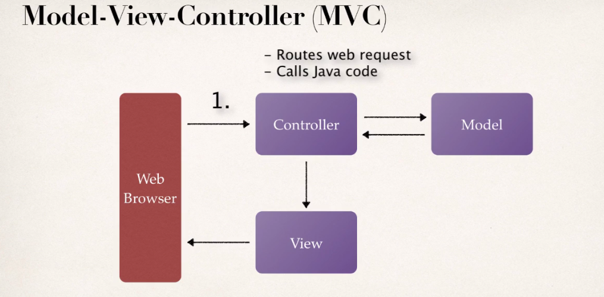
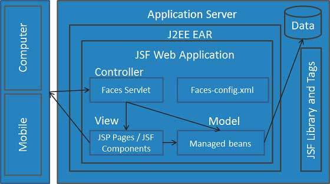
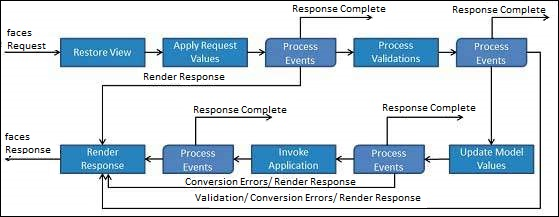
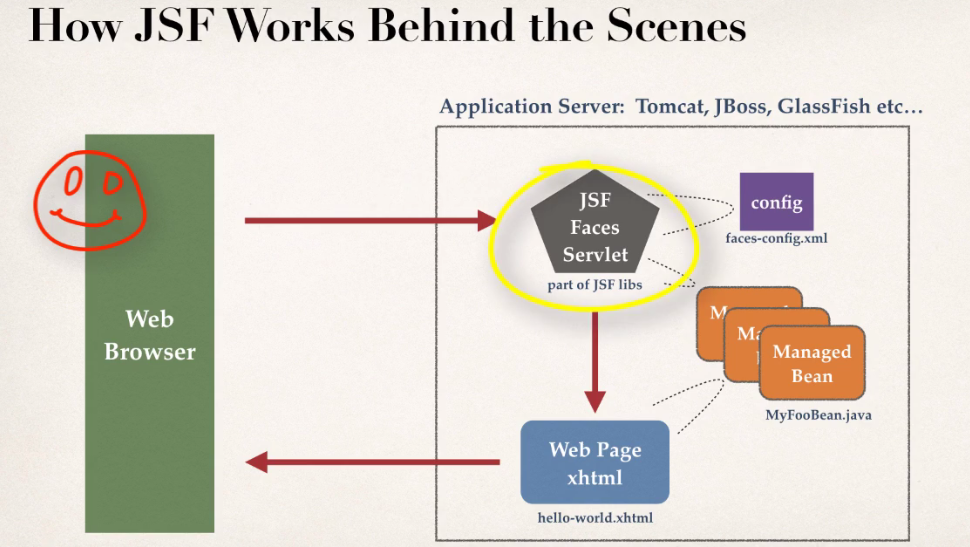

# JSF Overview
What is it?
* JavaServer Faces is a Java specification for building component-based user interfaces for web applications and was formalized as a standard through the Java Community Process being part of the Java Platform, Enterprise Edition.
* JavaServer™ Faces (JSF) is the standard component-oriented user interface (UI) framework for the Java EE platform. In terms which may sound more familiar, it's a Java-based web framework.
* Standard of Java Enterprise Edition (Java EE)
* It's MVC
  

* Leverages reusable UI elements
* Help manage application's state through multiple pages
* And most importantly, you can validate form data!
##JSF Architecture

* Third party(free) UI components
    * OpenFaces
    * RichFace
    * PrimeFaces
  

* JavaBeans handle model and data

## JSF Applications Lifecycle:

  

* **Phase 1:** Restore view phase starts as soon as a url is requested. During this phase, JFS builds the view and also wires handlers.

* **Phase 2:** Apply Request Value: each component decodes the information from a request

* **Phase 3:** Process validation, JSF processes all validators registered on the component tree. 
If the local value is invalid, JSF adds an error message to the FacesContext instance, and the life cycle advances to the render response phase and displays the same page again with the error message.

* **Phase 4:** Update model values, JFS walks over the component tree and sets the corresponding server-side object properties to the components' local values. 

* **Phase 5:** Invoke application, JSF handles any application-level events, such as submitting a form/linking to another page.

* **Phase 6:** Render response, JSF asks container/application server to render the page if the application is using JSP pages. 

## Components of a JSF Application
1- A set of web pages to layout UI components (facelets)
2- A set of managed Beans (backend)
3- A web deployment descriptor (web.xml)
* Optionally:
    * application configuration files (faces-config.xml)
    * custom objects, components, custom tags and validators
    
  


* xhtml is HTML page with special JSF tags
* The **JSF expression language** is used to
    * access properties of a managed bean
    * and some extra logic
 * @ManageBean classes need to have an **empty constructor** in addition to **getters/setters**
 
 
 
 ## Dev Notes:
 * selectManyCheckbox needs an array while selectOneMenu does not
 ```html
<h:selectManyCheckbox value="#{person.manyCheckbox}">
        <f:selectItem itemValue="0" itemLabel="Brazil"/>
        <f:selectItem itemValue="1" itemLabel="Iran"/>
        <f:selectItem itemValue="2" itemLabel="Canada"/>
</h:selectManyCheckbox>
``` 