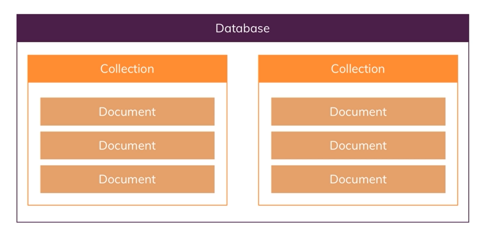
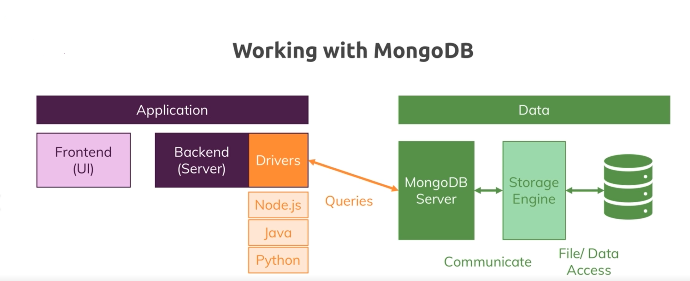

  


* **Definition**:
It's Humongous and Schemaless! 

* **Terminology**:
>DB -> Collection -> Document

  

* **Data Format**:
JSON which DB engine eventually translates to BSON before storing.
```json
{
    "name" : "bamzy",
    "age" : 31,
    "locked" : false,
    "address" : "123 Ave",
    "roles" : {"primary" : "admin", "secondary" : "author"},
    "hobbies" : [
        {"name" : "walking"},
        {"name" : "sleeping"}
    ]
}
```

## MongoDB Co. Ecosystem

* Graphic User Interface called Compass
* Mongo Mobile: to run MongoDB on phones
* Atlas: MongoDB on cloud
* BI Connectors
* MongoDB Charts
* Stitch: Serverless query API, Serverless Functions, Database Triggers
* Real-Time Sync

## Useful MongoDB Shell Commands
MongoDB shell allows you to interact with MongoDB Server and is quiet flexible.
```javascript
show dbs                            //Show all existing databases
db                                  //Shows current database
show collections                    //Show all collections in a database
db.dropDatabase()                   // Removes current DB
use [db_name]                       // Set working DB
db.createCollection(name,options)   //name is the collection name and options is an optional field that we can use to specify certain parameters such as size, max number of documents etc. in the collection.
db.[collection_name].[command_name] //General format of mongoDB commands
```

  

## Example
```js

db.createCollection('products')
db.products.insertOne(
    {
        name: "bamdad",
        age: 10
    }
)
// You can provide your own ID as long as its unique
db.products.insertOne(
    {
        name: "bamdad",
        age: 10,
        _id: 1
    }
)
// Insert multipel documents at once
db.products.insertMany(
    [{
        name: "Ali",
        age: 10,
        _id: 2
    },
    {
        name: "Mo",
        age: 20,
        _id: 3
    }]
)
db.products.find()              // returns all documents
db.products.findOne()           // returns one documents
db.products.find().pretty()     // returns all douments while prettified

db.products.find({price: {$gte: 100}}) //find greater than or equal
db.products.deleteOne({_id: 123456})    //Remove the first document with given ID
db.products.deleteMany({_id: 123456})    //Remove all document with given ID

//Don't forget $set when updating
db.products.updateOne({age: 10}, { $set:{{lastname: "kordi" }})

db.products.updateMany({}, { $set:{{locked: false }})
```