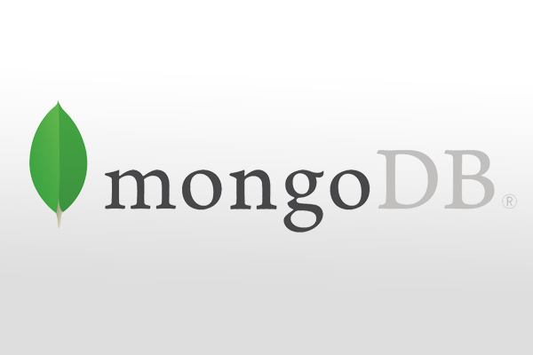
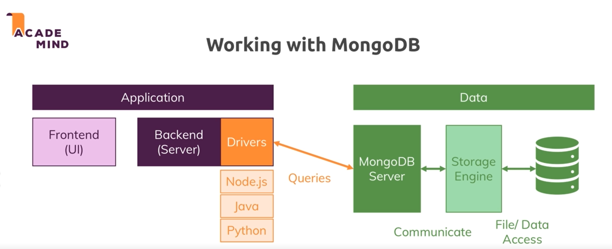

  


* **Definition**:
It's Humongous and Schemaless! 

* **Terminology**:
>DB -> Collection -> Document

* **Data Format**:
JSON which DB engine eventually translates to BSON before storin.
```json
{
    "name" : "bamzy",
    "age" : 31,
    "locked" : false,
    "address" : "123 Ave",
    "roles" : {"primary" : "admin", "secondary" : "author"},
    "hobbies" : [
        {"name" : "walking"},
        {"name" : "sleeping"}
    ]
}
```

## MongoDB Co. Ecosystem

* Graphic User Interface called Compass
* Mongo Mobile: to run MongoDB on phones
* Atlas: MongoDB on cloud
* BI Connectors
* MongoDB Charts
* Stitch: Serverless query API, Serverless Functions, Database Triggers
* Real-Time Sync

## Useful MongoDB Shell Commands

```javascript
show dbs                            //Show all existing databases
show collections                    //Show all collections in a database
use [db_name]                       // Set working DB
db.createCollection(name,options)   //name is the collection name and options is an optional field that we can use to specify certain parameters such as size, max number of documents etc. in the collection.
db.[collection_name].[command_name] //General format of mongoDB commands
```

  

## Example
```js

db.createCollection('products')
db.products.insertOne(
    {
        name: "bamdad",
        age: 10
    }
)
db.products.find() // returns all documents
db.products.find().pretty() // returns all douments while prettified
```