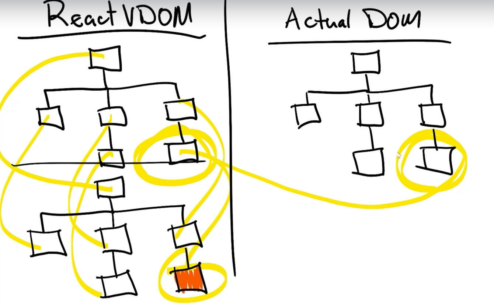

# React
    ## JSx
    ## ES6+
        ### Babel
    ## webpack
        

* ReactDom.Create() takes two arguments
1- a react element
2- a location to put it
3- react elements are virtual DOM objects that are significantly smaller
4- React tracks changes to these VDOMs and updates the UI
  
